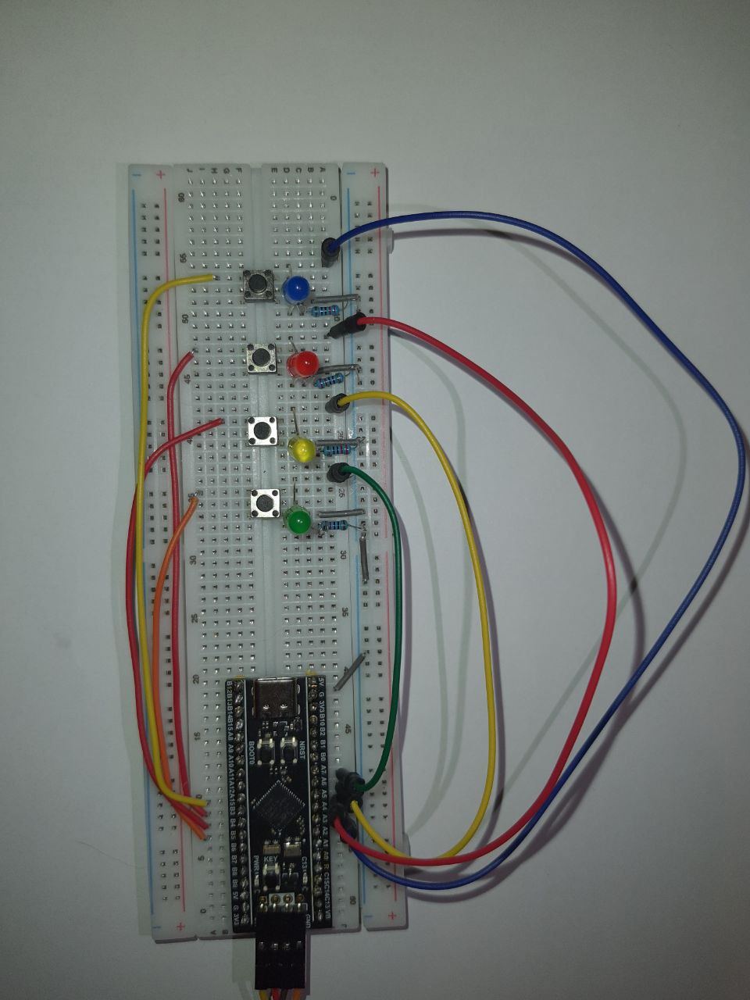

# STM32 Simon Says Game 🎮


A classic memory game implementation on **STM32F411 (Black Pill)** using **C++** and **STM32 HAL**. Ideally suited for demonstrating embedded development skills including GPIO control, interrupts, hardware timers, and state machine architecture.

 

## 📝 Description

"Simon Says" generates a random sequence of light signals that the player must repeat. The sequence becomes progressively longer with each level.

**Key Features:**
* **State Machine Architecture:** Clear separation of game logic states (Idle, Simon's Turn, Player's Turn, Win/Loss).
* **C++ Integration:** Utilizes `std::random` (Mersenne Twister) for high-quality sequence generation, seeded by user interaction timing (entropy).
* **Hardware Optimization:** Uses internal Pull-Up resistors to minimize external components.
* **Robust Input:** Implemented logical debouncing and "wait-for-release" protection.

## 🛠 Hardware Required

* **Microcontroller:** STM32F411CEU6 "Black Pill" (or similar STM32 board).
* **Programmer:** ST-Link V2 (SWD interface).
* **User Interface:**
    * 4x LEDs (Red, Green, Yellow, Blue recommended).
    * 4x Tactile Push Buttons.
    * 4x Resistors (220Ω - 330Ω).
* **Misc:** Breadboard, Jumper wires.

## 🔌 Pinout & Wiring

| Component | Pin (STM32) | Mode | Configuration |
| :--- | :--- | :--- | :--- |
| **Start Button** | PA0 (Key) | Input | Internal Pull-Up (Active Low) |
| **LED 1** | PA3 | Output | Push-Pull |
| **LED 2** | PA4 | Output | Push-Pull |
| **LED 3** | PA5 | Output | Push-Pull |
| **LED 4** | PA6 | Output | Push-Pull |
| **Button 1** | PB3 | Input | Internal Pull-Up (Active Low) |
| **Button 2** | PB4 | Input | Internal Pull-Up (Active Low) |
| **Button 3** | PB5 | Input | Internal Pull-Up (Active Low) |
| **Button 4** | PB6 | Input | Internal Pull-Up (Active Low) |

> **Note:** LEDs are connected via resistors to GND. Buttons connect the pin directly to GND (Internal Pull-Up ensures logical '1' when idle).

## 💻 Software & Tools

* **IDE:** STM32CubeIDE.
* **Framework:** STM32 HAL (Hardware Abstraction Layer).
* **Language:** C++ (Standard C++14/17 features enabled).

## 🚀 How to Build and Run

1.  **Clone the repository:**
    ```bash
    git clone https://github.com/Taras-Zaluzhnyi/STM32-Simon-Says-Game.git
    ```
2.  **Open in IDE:**
    * Launch STM32CubeIDE.
    * `File` -> `Open Projects from File System...`
3.  **Build:**
    * Press `Ctrl+B` (Hammer icon). Ensure there are 0 Errors.
4.  **Flash:**
    * Connect ST-Link V2 to the Black Pill (3.3V, GND, SWDIO, SWCLK).
    * Press `Run` (Green Play button).

## 🔮 Future Improvements

Current version (v1.0) focuses on logic stability. Future roadmap includes:

* [ ] **Refactor Timing:** Replace blocking `HAL_Delay` with non-blocking `HAL_GetTick()` based timers for better multitasking.
* [ ] **Audio Feedback:** Add a passive buzzer (PWM) to associate notes with each color.
* [ ] **High Score:** Implement Flash memory writing to save the best score between resets.
* [ ] **Power Saving:** Implement `Sleep Mode` when in IDLE state to save battery.

## 📄 License

This project is licensed under the MIT License - see the [LICENSE](LICENSE) file for details.
